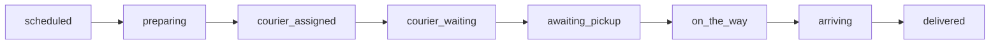

# Glovo for Home Assistant

Home Assistant custom integration for the [Glovo](https://glovoapp.com/) delivery service. It logs into your Glovo customer account and exposes live information about your current order — status, ETA, courier, progress — as Home Assistant sensors, binary sensors, and a courier `device_tracker` you can put on the map.


## Features

- **Live order tracking** — overall status, delivery stage, store, progress percent, and ETA
- **Courier and store on the map** — `device_tracker` entities for the courier's live GPS position and the order's pickup point
- **Adaptive polling** — uses your configured interval (default 15 s) when idle, and automatically switches to the API-recommended interval while an order is active
- **Token auto-refresh** — you enter a refresh token once; the integration keeps the short-lived access token fresh and persists it across restarts
- **Re-authentication flow** — if the token is ever rejected, Home Assistant prompts you for a new one
- **Options flow** — change the update interval (and refresh token) without removing the integration
- **Localized** — translations for all Home Assistant UI languages (48 locales)
- **Device triggers** — one automation trigger per order status (pick from the Glovo device in the UI)

## Installation

### HACS

> **Note:** This integration is not in the [default HACS repository](https://github.com/hacs/integration) yet. Until it is included, add this repo as a [custom repository](https://hacs.xyz/docs/faq/custom_repositories/) (category: **Integration**), then install **Glovo** and restart Home Assistant.

1. HACS → ⋮ → **Custom repositories**
2. Repository: `https://github.com/ClusterM/ha-glovo`, category: **Integration**
3. Install **Glovo**, then restart Home Assistant

### Manual

Copy `custom_components/glovo` into your Home Assistant `config/custom_components/` directory and restart Home Assistant.

## Getting the refresh token

The integration authenticates with a **refresh token** taken from your browser session on [glovoapp.com](https://glovoapp.com/):

1. Open [glovoapp.com](https://glovoapp.com/) and log in to your account.
2. Open the browser DevTools (F12) → **Application** (Chrome) / **Storage** (Firefox) → **Local Storage** → `https://glovoapp.com`.
3. Copy the value of the key **`glovo_refresh_token`**.

This long-lived token is exchanged for a short-lived access token by the integration; you only need to provide it once.

## Configuration

1. Settings → **Devices & Services** → **Add Integration** → **Glovo**
2. Paste the **refresh token** and set the **update interval** (seconds, default `15`)
3. Submit — the token is validated immediately. An invalid token is rejected right away.

Use **Configure** (Options) later to change the update interval, or to paste a new refresh token (leave the token field empty to keep the current one).

> Only a single Glovo account (one integration entry) is supported.

Make sure your Home Assistant **timezone** is set correctly under **Settings → System → General**. ETA windows (`Original ETA`, scheduled delivery times) and minute countdowns (`ETA min` / `ETA max`) are calculated in that timezone — a wrong value will shift all arrival times.

## Entities

All entities are grouped under one **Glovo** device. When there is no active order, sensors report empty/idle values rather than becoming unavailable.

### Sensors

| Entity | Description |
|--------|-------------|
| Order status | Combined high-level status (`preparing`, `on_the_way`, `arriving`, `delivered`, …). See [Order lifecycle](#order-lifecycle) below. Full summary is in attributes. |
| Stage | Raw lifecycle step (`in_progress`, `delivered`, `canceled`, …) — diagnostic |
| Store | Store / restaurant name |
| Active orders | Number of currently active orders |
| Courier | Courier name |
| Courier status | `assigned`, `waiting`, `on_the_way`, `arriving` — diagnostic |
| Store status | `preparing`, `ready` — diagnostic |
| Progress | Delivery progress, % |
| ETA min / ETA max | Minutes until arrival (lower and upper bound) |
| Original ETA | Initial ETA window before a late re-estimate |
| Recommended poll interval | API-suggested polling interval (diagnostic, disabled by default) |

### Binary sensors

| Entity | Description |
|--------|-------------|
| Active order | On when at least one order is active |
| Late | On when the delivery is running late |
| Chat available | On when courier chat is available (diagnostic) |

### Device tracker

| Entity | Description |
|--------|-------------|
| Courier location | Courier's live GPS position. Extra attributes: `heading`, `courier_name`, privacy-safe two-letter `courier_initials`, and `courier_count`. |
| Store location | Store/pickup GPS position. Available only when tracking has exactly one valid pickup marker. |

The native map derives its default marker text from initials of the entity's
friendly-name words; a `device_tracker` cannot set separate marker text. On
frontend versions that support map `label_mode`, use the `courier_initials`
attribute for the exact dynamic two-letter marker and a card-level stable store
label:

```yaml
type: map
entities:
  - entity: device_tracker.glovo_courier_location
    label_mode: attribute
    attribute: courier_initials
  - entity: device_tracker.glovo_store_location
    name: Store
```

Existing entity-registry customizations can produce different entity IDs; select
the two Glovo trackers from the map card editor if yours differ.

## Order lifecycle

The **Order status** sensor combines three API fields — `step`, `partnerStatus` (store), and `courierStatus` — into one enum that is easier to automate against.

Typical happy-path flow:



| Order status | `step` | `partner_status` | `courier_status` | Meaning |
|--------------|--------|------------------|------------------|---------|
| `scheduled` | `SCHEDULED` | — | — | Order scheduled for later |
| `preparing` | `IN_PROGRESS` | `PREPARING` | — | Store is preparing, no courier yet |
| `courier_assigned` | `IN_PROGRESS` | `PREPARING` | `ASSIGNED` | Store preparing, courier assigned |
| `courier_waiting` | `IN_PROGRESS` | `PREPARING` | `WAITING` | Courier at the store, order still preparing |
| `awaiting_pickup` | `IN_PROGRESS` | `READY` | not `WAITING` / `ON_THE_WAY` / `ARRIVING` | Order ready, waiting for pickup |
| `on_the_way` | `IN_PROGRESS` | * | `ON_THE_WAY` | Courier en route to you |
| `arriving` | `IN_PROGRESS` | * | `ARRIVING` | Courier arriving at your location |
| `delivered` | `DELIVERED` | — | — | Delivered |
| `canceled` | `CANCELED` / `CANCELLED` | — | — | Canceled |

Once the courier has left the store, `courier_status` drives the status (`on_the_way`, `arriving`). Before pickup, store and courier states are combined as in the table.

> **Scheduled orders:** In the Glovo orders list they appear as `INACTIVE_ORDER` (not `ACTIVE_ORDER`), but tracking reports `step=SCHEDULED`. The integration detects them by probing recent list rows when no active order is present. While tracking has no live ETA yet, **ETA min/max** and **Original ETA** are computed from `scheduledTime` / `scheduledTimeEnd` in the v3 order details.

Machine values are lowercase (e.g. `courier_assigned`). Use these in YAML automations; the UI shows translated labels (Russian: «Готовится, курьер назначен» for `courier_assigned`).

## Automations

### Device triggers (recommended)

Settings → **Automations** → **Create automation** → **Device** → select the **Glovo** device. You get one trigger per order status, e.g. *Order status becomes courier on the way to you* or *Статус заказа: курьер в пути к вам*. Optional **For** duration is supported.

### YAML example

```yaml
automation:
  - alias: Glovo — courier arriving
    triggers:
      - trigger: state
        entity_id: sensor.glovo_order_status
        to: arriving
    actions:
      - action: notify.mobile_app_phone
        data:
          message: "Glovo courier is almost here"
```

Replace `sensor.glovo_order_status` with your entity id (Settings → Entities).

### Spoken summary template

A Jinja2 template that turns the current order state into a short human-readable sentence. It works well as a **voice assistant response** (e.g. answering "Where is my order?") or as a notification body. Adjust the entity ids to match yours.

```jinja


There are no active orders right now.

The order from {{ states('sensor.glovo_store') }} is scheduled.

The order from {{ states('sensor.glovo_store') }} is being prepared.

The order from {{ states('sensor.glovo_store') }} is being prepared, courier {{ states('sensor.glovo_courier_name') }} is assigned.

Courier {{ states('sensor.glovo_courier_name') }} is waiting for the order at the store.

The {{ states('sensor.glovo_store') }} store is waiting for courier {{ states('sensor.glovo_courier_name') }}.

Courier {{ states('sensor.glovo_courier_name') }} is on the way to you.

Courier {{ states('sensor.glovo_courier_name') }} is almost here.

The order from {{ states('sensor.glovo_store') }} has been delivered.

The order was canceled.

No idea what is going on with this order.



 It is running late.

About {{ states('sensor.glovo_eta_min') }} min left.

About {{ states('sensor.glovo_eta_min') }}–{{ states('sensor.glovo_eta_max') }} min left.


```

<details>
<summary>Russian variant (uses the <a href="https://github.com/AlexxIT/MorphNumbers">MorphNumbers</a> integration for number agreement)</summary>

> Requires the [MorphNumbers](https://github.com/AlexxIT/MorphNumbers) integration installed for the `format(morph=…)` filter.

```jinja


Похоже, что сейчас нет активных заказов.

Заказ из {{ states('sensor.glovo_store') }} ещё только запланирован.

Заказ из {{ states('sensor.glovo_store') }} готовится.

Заказ из {{ states('sensor.glovo_store') }} собирается, назначен курьер {{ states('sensor.glovo_courier_name') }}.

Курьер {{ states('sensor.glovo_courier_name') }} ждёт заказ в магазине.

Магазин {{ states('sensor.glovo_store') }} ожидает курьера {{ states('sensor.glovo_courier_name') }}.

Курьер {{ states('sensor.glovo_courier_name') }} в пути к вам.

Курьер {{ states('sensor.glovo_courier_name') }} уже совсем рядом.

Заказ из {{ states('sensor.glovo_store') }} доставлен.

Заказ отменён.

Хрен его знает, что с этим заказом.



 Задерживается.

{{ states('sensor.glovo_eta_min')|format(morph=['Осталась','Осталось','Осталось'], as_text=None) }} примерно {{ states('sensor.glovo_eta_min')|format(morph='минута') }}.

Осталось примерно {{ (states('sensor.glovo_eta_min')|format(morph='минута')).split()[:-1]|join(' ') }} - {{ states('sensor.glovo_eta_max')|format(morph='минута') }}.


```

</details>

## How polling works

The integration calls the Glovo customer API and builds a flat summary of the most recent active order. While an order is active, the API returns a recommended polling interval (`pollingIntervalMillis`), and the integration follows it for near-real-time courier updates. When no order is active, it falls back to the interval you configured.

## Requirements

- Home Assistant `2024.12.0` or newer
- A Glovo account and its `glovo_refresh_token` (see above)
- Outbound internet access to `api.glovoapp.com`

## Disclaimer

This is an unofficial integration that uses Glovo's private customer API and is not affiliated with, endorsed by, or supported by Glovo. The API may change at any time and break this integration. Use at your own risk, and only with your own account.

## License

GPLv3 License

## Support the Developer and the Project

* [GitHub Sponsors](https://github.com/sponsors/ClusterM)

* [Patreon](https://www.patreon.com/c/ClusterMeerkat)

* [Buy Me A Coffee](https://www.buymeacoffee.com/cluster)

* [Sber](https://messenger.online.sberbank.ru/sl/Lnb2OLE4JsyiEhQgC)

* [Donation Alerts](https://www.donationalerts.com/r/clustermeerkat)

* [Boosty](https://boosty.to/cluster)
