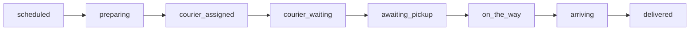

# Glovo for Home Assistant

Home Assistant custom integration for the [Glovo](https://glovoapp.com/) delivery service. It logs into your Glovo customer account and exposes live information about your current order — status, ETA, courier, progress — as Home Assistant sensors, binary sensors, and a courier `device_tracker` you can put on the map.


## Features

- **Live order tracking** — overall status, delivery stage, store, progress percent, and ETA
- **Courier and store on the map** — `device_tracker` entities for the courier's live GPS position and the order's pickup point
- **Adaptive polling** — uses your configured interval (default 15 s) when idle, and automatically switches to the API-recommended interval while an order is active
- **Token auto-refresh** — you enter a refresh token once; the integration keeps the short-lived access token fresh and persists it across restarts
- **Re-authentication flow** — if the token is ever rejected, Home Assistant prompts you for a new one
- **Options flow** — change the update interval (and refresh token) without removing the integration
- **Localized** — translations for all Home Assistant UI languages (48 locales)
- **Device triggers** — one automation trigger per order status (pick from the Glovo device in the UI)

## Experimental admin ordering preparation

The integration includes a default-off, administrator-only ordering workspace. An
administrator must enable `allow_ordering` in the Glovo options flow and explicitly
acknowledge its warning before the panel is registered. The option stays off across
new setup, migration, restore, reload, and reauthentication unless the administrator
enables it.

The responsive panel can display authenticated saved addresses, look up an explicit
store slug or URL, search and filter a live catalog, customize products, maintain a
local draft, explicitly synchronize an authoritative remote basket, and request an
authoritative quote. Remote basket writes are consequential: they are serialized,
receive one attempt, and are never automatically retried after an ambiguous result.
Changing the address invalidates store, menu, basket, quote, and confirmation
authority. A quote remains fresh for at most 45 seconds.

Store availability and menu availability are independent. When Glovo returns a menu
for an enabled but currently closed store, the panel keeps it visible with a prominent
browse-only warning. Closed-store handles cannot create a local prepared package,
compile or synchronize a basket, request a quote, prepare confirmation, check out, pay,
or order. Basket synchronization also performs one fresh GET-only store eligibility
check immediately before its single provider mutation attempt.

### Durable packages

The admin panel stores private, account-bound reusable package recipes in Home
Assistant storage. A package is one named or aliased, one-store, multi-item configured
cart. Names and aliases use deterministic exact normalization and compare-and-swap
revisions. Browser storage is never authoritative. Packages retain stable product and
option intent rather than ephemeral session or basket handles, and never own or pin a
delivery address.

Loading a package requires the admin to choose a fresh current saved Glovo address,
then performs GET-only reconciliation of the explicit store, products, option groups,
and options. Removed, ambiguous, or changed catalog selections return an explicit
stale result and perform **zero basket writes**. A successfully reconciled package is
loaded into the local draft; **Sync basket** is still a separate explicit action.

The authenticated `library/package_prepare` operation accepts only a package key and
a fresh address handle from the current saved-address read. It is a preparation
boundary for a possible future assistant or automation integration, not purchase
authority. This release registers no Home Assistant ordering service, intent, event,
webhook, MQTT command, or entity action. Packages cannot confirm, pay for, submit, or
place an order.

### Guarded live paid checkout in Home.19

Release `1.1.0+home.19` production-composes the reviewed strict final request factory
and one-attempt adapter only when fresh preparation and paid-checkout switch/
acknowledgement pairs are all literally true and durable authority is healthy. Config
entry migration v12 closes all four gates—even for an opted-in Home.18 entry with all four
true—while preserving unrelated options. New setup and reauthentication
also close them. The administrator must complete a fresh re-opt-in after migration.
Preparation consent alone constructs no final adapter, publishes final checkout
unavailable, and registers no final-submit command.

Home.19 retains Home.14's privacy-safe basket failure classification and Home.15's durable
account-scoped basket authority. The closed runtime states are
`UNKNOWN`, `ABSENT_VERIFIED`, `ADOPTED`, and `CONFLICT`; missing runtime memory is never
projected as an empty writable basket. All administrators share one authority and whole
operations are cross-administrator serialized. Discovery performs one collection GET
plus at most one conditional full per-store GET, with no query, polling, fallback,
retry, or mutation. It strictly rejects multiple, malformed, oversized, inconsistent,
or mismatched provider state.

Home.19 narrows two display-only compatibility rules after a complete public-schema audit:
rich-basket `storeInfo.logo` may be `null` or the existing bounded string. The value is
validated and discarded. Product `quantity.incrementsLimit` accepts a nonnegative signed
32-bit provider ceiling independently of the local hard quantity cap; zero and ceilings
above 50 normalize to the existing no-limit state within that closed domain. Negative,
string, boolean, floating-point, and overflow limits remain rejected. Objects,
arrays, booleans, numbers, oversized strings, unknown
keys, and all identity, product, store, address, price, and basket-version mismatches remain
fail-closed.

The public basket schema permits repeated optional product enrichment identifiers.
Home.19 therefore requires uniqueness only for the authoritative catalog `product_id` used
for exact intent mapping and the provider `basketProductId` used for basket-line identity.
Repeated `externalId`, `legacyId`, or `storeProductId` values are accepted but remain
strictly matched whenever the prepared intent supplied one. Product count and total
quantity caps are unchanged and now report exact privacy-safe diagnostic paths.

A dedicated private Home Assistant Store retains only hash-only account, store, intent,
and provider-snapshot evidence with its generation/state/time metadata. It retains no
provider IDs, products, addresses, handles, payloads, credentials, or raw persisted
values. Durable evidence is not mutation authority: after every setup or reload,
ephemeral handles are invalidated and the runtime requires fresh provider re-adoption
against a fresh account, saved address, store, menu, and product context. An explicit
read-only adoption action must precede any basket mutation. Only fresh verified absence
may select one explicit create; a different/multiple/ambiguous basket is `CONFLICT` and
blocks. A deterministic rejected replace/delete never degrades into create, and no
ambiguous mutation is retried.

Historical Home.8 and Home.9 builds are unsafe/no-go release candidates for provider
basket mutation: Home.8 stopped on the documented provider rejection, while Home.9 did
not yet provide this durable reload/re-adoption boundary. Neither identity should be
used to infer writable basket absence or consent.

Home.19 keeps `ORDERING_WEB_VERSION` at `v1.2569.0`, the latest reproducibly preserved
authenticated first-party evidence. Later public landing and marketplace bundles did not
expose a newer authenticated basket constant, so this release does not claim one.

Preparatory post-dispatch failures remain conservative. Only a closed
`provider_rejection` with an explicitly allowlisted deterministic HTTP status becomes
terminal provider failure. Missing or unapproved status, transport/5xx/cancellation,
malformed success, parser mismatch, and every other unknown outcome durably require
reconciliation and block later ordering; exception class names carry no authority.

An unresolved preparatory write keeps every normal mutation and final submission
blocked. An administrator may record one local, challenge-bound observation; this
performs no provider request and never re-submits the original write. The authority
record, exact account binding, and durable generation are updated in fail-closed order.
Manual paid-checkout recovery remains independently visible when both recovery kinds
coexist, and no private preparation identity is exposed.

Paid quote creation, exact confirmation, and checkout are separate actions from basket
adoption or mutation. Only a provider-selected saved card is supported. The final review
displays the exact store, items/quantities/options, provider price lines, total and ISO
currency, ETA, expiry, masked card, and full saved address. The full address is admin-only
and **ephemeral**: it is not written to journals, logs, diagnostics, or recovery payloads.
The administrator must type an acknowledgement bound to the fresh exact quote's
minor-unit amount and currency.

Final submission is exactly one `POST /v3/checkouts/order/1` using the server template's
exact quoted projection. There is no automatic retry, refresh-and-replay, fallback,
checkout completion, cancellation, redirect, capture, or payment mutation. Pending or
interactive payment/auth states, timeout, cancellation, malformed or contradictory
responses, transport loss, identity mismatch, and persistence uncertainty become
`MANUAL_CHECK_REQUIRED` and block every later checkout across restart.

If the response privately yielded a checkout ID, each explicit administrator status
action performs exactly one `GET /v3/checkouts/order/{checkoutId}`; there is no polling.
With no learned ID it performs zero GETs. Public and recovery projections reveal only
`hasCheckoutId`, never the identifier. Provider-confirmed success additionally requires
an exact basket, amount, and currency match; all other ambiguity remains manual.

The [reviewed static protocol evidence](docs/live-ordering-protocol-evidence.md) makes no
provider idempotency claim and does **not** establish lookup by `checkoutSessionId`.
Home.19 is offline release readiness only: it does not claim deployment, a live canary,
quote, basket adoption, checkout, payment, or provider call. Follow the
[operator runbook](docs/live-ordering-operator-runbook.md) and
[release checklist](docs/live-ordering-release-checklist.md); disabling or rolling back
never clears unresolved durable state.

## Installation

### HACS

> **Note:** This integration is not in the [default HACS repository](https://github.com/hacs/integration) yet. Until it is included, add this repo as a [custom repository](https://hacs.xyz/docs/faq/custom_repositories/) (category: **Integration**), then install **Glovo** and restart Home Assistant.

1. HACS → ⋮ → **Custom repositories**
2. Repository: `https://github.com/ClusterM/ha-glovo`, category: **Integration**
3. Install **Glovo**, then restart Home Assistant

### Manual

Copy `custom_components/glovo` into your Home Assistant `config/custom_components/` directory and restart Home Assistant.

## Getting the refresh token

The integration authenticates with a **refresh token** taken from your browser session on [glovoapp.com](https://glovoapp.com/):

1. Open [glovoapp.com](https://glovoapp.com/) and log in to your account.
2. Open the browser DevTools (F12) → **Application** (Chrome) / **Storage** (Firefox) → **Local Storage** → `https://glovoapp.com`.
3. Copy the value of the key **`glovo_refresh_token`**.

This long-lived token is exchanged for a short-lived access token by the integration; you only need to provide it once.

## Configuration

1. Settings → **Devices & Services** → **Add Integration** → **Glovo**
2. Paste the **refresh token** and set the **update interval** (seconds, default `15`)
3. Submit — the token is validated immediately. An invalid token is rejected right away.

Use **Configure** (Options) later to change the update interval, or to paste a new refresh token (leave the token field empty to keep the current one).

> Only a single Glovo account (one integration entry) is supported.

Make sure your Home Assistant **timezone** is set correctly under **Settings → System → General**. ETA windows (`Original ETA`, scheduled delivery times) and minute countdowns (`ETA min` / `ETA max`) are calculated in that timezone — a wrong value will shift all arrival times.

## Entities

All entities are grouped under one **Glovo** device. When there is no active order, sensors report empty/idle values rather than becoming unavailable.

### Sensors

| Entity | Description |
|--------|-------------|
| Order status | Combined high-level status (`preparing`, `on_the_way`, `arriving`, `delivered`, …). See [Order lifecycle](#order-lifecycle) below. Full summary is in attributes. |
| Stage | Raw lifecycle step (`in_progress`, `delivered`, `canceled`, …) — diagnostic |
| Store | Store / restaurant name |
| Active orders | Number of currently active orders |
| Courier | Courier name |
| Courier status | `assigned`, `waiting`, `on_the_way`, `arriving` — diagnostic |
| Store status | `preparing`, `ready` — diagnostic |
| Progress | Delivery progress, % |
| ETA min / ETA max | Minutes until arrival (lower and upper bound) |
| Original ETA | Initial ETA window before a late re-estimate |
| Recommended poll interval | API-suggested polling interval (diagnostic, disabled by default) |

### Binary sensors

| Entity | Description |
|--------|-------------|
| Active order | On when at least one order is active |
| Late | On when the delivery is running late |
| Chat available | On when courier chat is available (diagnostic) |

### Device tracker

| Entity | Description |
|--------|-------------|
| Courier location | Courier's live GPS position. Extra attributes: `heading`, `courier_name`, privacy-safe two-letter `courier_initials`, and `courier_count`. |
| Store location | Store/pickup GPS position. Available only when tracking has exactly one valid pickup marker. |

The native map derives its default marker text from initials of the entity's
friendly-name words; a `device_tracker` cannot set separate marker text. On
frontend versions that support map `label_mode`, use the `courier_initials`
attribute for the exact dynamic two-letter marker and a card-level stable store
label:

```yaml
type: map
entities:
  - entity: device_tracker.glovo_courier_location
    label_mode: attribute
    attribute: courier_initials
  - entity: device_tracker.glovo_store_location
    name: Store
```

Existing entity-registry customizations can produce different entity IDs; select
the two Glovo trackers from the map card editor if yours differ.

## Order lifecycle

The **Order status** sensor combines three API fields — `step`, `partnerStatus` (store), and `courierStatus` — into one enum that is easier to automate against.

Typical happy-path flow:



| Order status | `step` | `partner_status` | `courier_status` | Meaning |
|--------------|--------|------------------|------------------|---------|
| `scheduled` | `SCHEDULED` | — | — | Order scheduled for later |
| `preparing` | `IN_PROGRESS` | `PREPARING` | — | Store is preparing, no courier yet |
| `courier_assigned` | `IN_PROGRESS` | `PREPARING` | `ASSIGNED` | Store preparing, courier assigned |
| `courier_waiting` | `IN_PROGRESS` | `PREPARING` | `WAITING` | Courier at the store, order still preparing |
| `awaiting_pickup` | `IN_PROGRESS` | `READY` | not `WAITING` / `ON_THE_WAY` / `ARRIVING` | Order ready, waiting for pickup |
| `on_the_way` | `IN_PROGRESS` | * | `ON_THE_WAY` | Courier en route to you |
| `arriving` | `IN_PROGRESS` | * | `ARRIVING` | Courier arriving at your location |
| `delivered` | `DELIVERED` | — | — | Delivered |
| `canceled` | `CANCELED` / `CANCELLED` | — | — | Canceled |

Once the courier has left the store, `courier_status` drives the status (`on_the_way`, `arriving`). Before pickup, store and courier states are combined as in the table.

> **Scheduled orders:** In the Glovo orders list they appear as `INACTIVE_ORDER` (not `ACTIVE_ORDER`), but tracking reports `step=SCHEDULED`. The integration detects them by probing recent list rows when no active order is present. While tracking has no live ETA yet, **ETA min/max** and **Original ETA** are computed from `scheduledTime` / `scheduledTimeEnd` in the v3 order details.

Machine values are lowercase (e.g. `courier_assigned`). Use these in YAML automations; the UI shows translated labels (Russian: «Готовится, курьер назначен» for `courier_assigned`).

## Automations

### Device triggers (recommended)

Settings → **Automations** → **Create automation** → **Device** → select the **Glovo** device. You get one trigger per order status, e.g. *Order status becomes courier on the way to you* or *Статус заказа: курьер в пути к вам*. Optional **For** duration is supported.

### YAML example

```yaml
automation:
  - alias: Glovo — courier arriving
    triggers:
      - trigger: state
        entity_id: sensor.glovo_order_status
        to: arriving
    actions:
      - action: notify.mobile_app_phone
        data:
          message: "Glovo courier is almost here"
```

Replace `sensor.glovo_order_status` with your entity id (Settings → Entities).

### Spoken summary template

A Jinja2 template that turns the current order state into a short human-readable sentence. It works well as a **voice assistant response** (e.g. answering "Where is my order?") or as a notification body. Adjust the entity ids to match yours.

```jinja


There are no active orders right now.

The order from {{ states('sensor.glovo_store') }} is scheduled.

The order from {{ states('sensor.glovo_store') }} is being prepared.

The order from {{ states('sensor.glovo_store') }} is being prepared, courier {{ states('sensor.glovo_courier_name') }} is assigned.

Courier {{ states('sensor.glovo_courier_name') }} is waiting for the order at the store.

The {{ states('sensor.glovo_store') }} store is waiting for courier {{ states('sensor.glovo_courier_name') }}.

Courier {{ states('sensor.glovo_courier_name') }} is on the way to you.

Courier {{ states('sensor.glovo_courier_name') }} is almost here.

The order from {{ states('sensor.glovo_store') }} has been delivered.

The order was canceled.

No idea what is going on with this order.



 It is running late.

About {{ states('sensor.glovo_eta_min') }} min left.

About {{ states('sensor.glovo_eta_min') }}–{{ states('sensor.glovo_eta_max') }} min left.


```

<details>
<summary>Russian variant (uses the <a href="https://github.com/AlexxIT/MorphNumbers">MorphNumbers</a> integration for number agreement)</summary>

> Requires the [MorphNumbers](https://github.com/AlexxIT/MorphNumbers) integration installed for the `format(morph=…)` filter.

```jinja


Похоже, что сейчас нет активных заказов.

Заказ из {{ states('sensor.glovo_store') }} ещё только запланирован.

Заказ из {{ states('sensor.glovo_store') }} готовится.

Заказ из {{ states('sensor.glovo_store') }} собирается, назначен курьер {{ states('sensor.glovo_courier_name') }}.

Курьер {{ states('sensor.glovo_courier_name') }} ждёт заказ в магазине.

Магазин {{ states('sensor.glovo_store') }} ожидает курьера {{ states('sensor.glovo_courier_name') }}.

Курьер {{ states('sensor.glovo_courier_name') }} в пути к вам.

Курьер {{ states('sensor.glovo_courier_name') }} уже совсем рядом.

Заказ из {{ states('sensor.glovo_store') }} доставлен.

Заказ отменён.

Хрен его знает, что с этим заказом.



 Задерживается.

{{ states('sensor.glovo_eta_min')|format(morph=['Осталась','Осталось','Осталось'], as_text=None) }} примерно {{ states('sensor.glovo_eta_min')|format(morph='минута') }}.

Осталось примерно {{ (states('sensor.glovo_eta_min')|format(morph='минута')).split()[:-1]|join(' ') }} - {{ states('sensor.glovo_eta_max')|format(morph='минута') }}.


```

</details>

## How polling works

The integration calls the Glovo customer API and builds a flat summary of the most recent active order. While an order is active, the API returns a recommended polling interval (`pollingIntervalMillis`), and the integration follows it for near-real-time courier updates. When no order is active, it falls back to the interval you configured.

## Requirements

- Home Assistant `2024.12.0` or newer
- A Glovo account and its `glovo_refresh_token` (see above)
- Outbound internet access to `api.glovoapp.com`

## Disclaimer

This is an unofficial integration that uses Glovo's private customer API and is not affiliated with, endorsed by, or supported by Glovo. The API may change at any time and break this integration. Use at your own risk, and only with your own account.

## License

GPLv3 License

## Support the Developer and the Project

* [GitHub Sponsors](https://github.com/sponsors/ClusterM)

* [Patreon](https://www.patreon.com/c/ClusterMeerkat)

* [Buy Me A Coffee](https://www.buymeacoffee.com/cluster)

* [Sber](https://messenger.online.sberbank.ru/sl/Lnb2OLE4JsyiEhQgC)

* [Donation Alerts](https://www.donationalerts.com/r/clustermeerkat)

* [Boosty](https://boosty.to/cluster)
